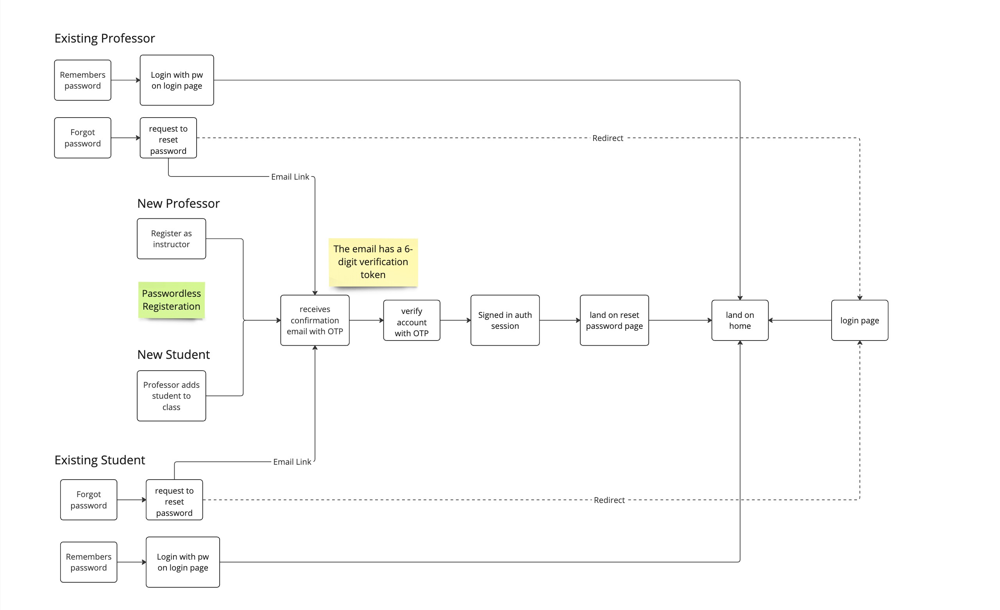

# [GradeBoost](https://gradeboost.cs.calvin.edu)

## Introducing GradeBoost – Revolutionizing the Grade Appeal Process!

Are you tired of the traditional hassles associated with appealing grades? Look no further!

## Why GradeBoost?

**Centralized and Streamlined Process:** Say goodbye to scattered emails and cluttered inboxes! GradeBoost provides a centralized platform for students to submit, track, and resolve grade appeals effortlessly. No more lost appeals or overlooked messages.

**User-Friendly Interface:** Our intuitive interface makes navigating through courses and submitting assignment-specific appeals a breeze. Students can easily track the progress of their appeals, receive updates, and engage in seamless communication with professors through a dedicated discussion thread.

**Efficient Professor Dashboard:** Professors, rejoice! The centralized dashboard allows you to view all student appeals at a glance. Respond, reassign appeals, forward them to graders, and utilize pre-written templates to streamline your responses. GradeBoost is designed to make your life easier.

**Interactive Discussion Threads:** Foster effective communication with your professors through dynamic discussion threads. Share thoughts, seek clarification, and engage in meaningful conversations to ensure your voice is heard.

**Templates for Efficiency:** Professors, save time with our pre-written templates designed to assist you in crafting timely and effective responses. Streamline your workflow and focus on what matters most – educating and supporting your students.

## Meet the Team

- Ael Lee
  - Github [@aellxx](https://github.com/aellxx)
  - LinkedIn: [Ael Lee](https://www.linkedin.com/in/aellee/)
- Tyler Voss
  - Github: [@tylervoss101](https://github.com/tylervoss101)
  - LinkedIn: [Tyler Voss](https://www.linkedin.com/in/tyler-voss-57238119b/)
- Justin Voss
  - Github: [@justinianvoss22](https://github.com/justinianvoss22)
  - LinkedIn: [Justin Voss](https://www.linkedin.com/in/justin-voss-348aa8205/)
- Sam Hoogewind
  - Github: [@samhoog](https://github.com/samhoog)
  - LinkedIn: [Sam Hoogewind](https://www.linkedin.com/in/sam-hoogewind-2bb264271/)

## Our Mentor: Professor Victor Norman

Professor Norman was not just our mentor, but our advocate and inspiration behind it! Tired of his overcrowded inbox, Professor Norman envisioned a solution that could help both students and professors. His passion for simplifying the grade appeal process fueled the development of GradeBoost.
Our website is deployed on [gradeboost.cs.calvin.edu](https://gradeboost.cs.calvin.edu)

## Tech Stack

- Frontend: [Angular](https://angular.io/)
- Backend: [Supabase](https://supabase.com/dashboard/project/nsxdlyqbigoijypmnsqe)
- Containerization: [Docker](https://www.docker.com/)
- Email API: [Resend](https://resend.com/home)

# Docker Containerization

The website is containerized using Docker and hosted on the cs.calvin.edu domain. There are 3 files associated with Docker containerization in this repository:

1. [`.dockerignore`](.dockerignore): The .dockerignore file specifies the files and directories to exclude when building the Docker image.

2. [`Dockerfile`](Dockerfile): This text file that contains instructions for building the Docker image. It specifies the base image, sets up the environment, installs dependencies, and copies the secrets needed for Supabase authentication.

3. [`docker-compose.yml`](docker-compose.yml): This file is used to define and run our Docker containers. It specifies the secrets used in our application, the image to run, and the port.

> Special Thanks to Chris Wieringa for helping us host the website on Calvin's Azure server!

# Authentication Workflow



## Professor Authentication

Professors are Calvin faculty/instructors with a valid email in the form of `firstname`.`lastname`@calvin.edu. They are the only type of users who can register through the website.

Instructors have administrator permissions, meaning they are able to verify and reset the passwords of Student users through the [Roster](./src/app/components/Professor/roster/roster.component.ts) page under the Course tab.

## Student Authentication

Students are Calvin users with the `initials + number`@calvin.edu email format. Student users cannot manually register themselves as users. Student accounts are only created when a Professor user invites them by adding students to a course.

When a Student user is invited to a course, he/she will receive an invitation email with a 6-digit one-time password (OTP) that they can use to verify themselves. Once they are authenticated, the Student will be able to set a password for themselves.

> Sometimes, the invitations and/or password recovery emails are blocked by Microsoft Outlook. As a workaround for this issue, we have given Professors administrator rights to verify and reset Students' passwords in case Student users are unable to do so themselves.

## Password Recovery

The general password recovery flow is the same for both Professor and Student users. On the [reset password page](https://gradeboost.cs.calvin.edu/request-token), users enter their emails, and a six-digit OTP will be sent to them along with a link that opens a page allowing them to enter the OTP and authenticate themselves. If the authentication is successful, users will be directed to a page where they can reset their passwords.

## Token Expiration

If a user receives an OTP and does not use it before it expires, they can request another token through the [request token page](https://gradeboost.cs.calvin.edu/request-token). From here, the process is identical to the [password recovery](#password-recovery) process.

# Supabase Functions

All database queries are made through Postgres Functions rather than direct database queries. These can be found in our Service repository, as well as in the Supabase web console, under `Database` > `Functions`.

The TypeScript code to call PostgreSQL functions are stored under the [`services` directory](./src/app/services/) in the `.service.ts` files.

## Helpful Links and Sources

- [Supabase Javascript Client Docs](https://supabase.com/docs/reference/javascript/introduction)
- [Call a Postgres Function](https://supabase.com/docs/reference/javascript/rpc)

# Supabase Realtime

Supabase's [realtime functionality](https://supabase.com/docs/guides/realtime) allows us to sync database changes to the UI immediately after a postgres event (`INSERT`, `UPDATE` or `DELETE`)

The base function that is used to listen to Postgres events is written in [shared.service.ts](./src/app/services/shared.service.ts).

```js
getTableChanges(
    tableName: string,
    channelName: string,
    filter?: string
  ): Observable<any> {
    const changes = new Subject();

    this.supabase
      .channel(channelName)
      .on(
        'postgres_changes',
        { event: '*', schema: 'public', table: tableName, filter: filter },
        (payload) => {
          changes.next(payload);
        }
      )
      .subscribe();

    return changes.asObservable();
  }
```

In every component that needs to listen to database changes are functions that are written similar to the following (example from [roster.component.ts](src/app/components/Professor/roster/roster.component.ts)):

```js
  handleStudentUpdates(): void {
    this.sharedService
      .getTableChanges(
        'StudentCourse',
        'student-course-channel',
        `course_id=eq.${this.courseID}`
      )
      .subscribe(async (update: any) => {
        // if insert or update event, get new row
        // if delete event, get deleted row ID
        const record =
          update.new?.course_id && update.new?.student_id
            ? update.new
            : update.old;
        // INSERT or DELETE
        const event = update.eventType;
        if (!record) return;
        // new student inserted
        if (event === 'INSERT') {
          // get new student
          const { student_id, course_id } = record;

          // get student & course information
          const { id, first_name, last_name, email, is_verified } =
            await this.sharedService.getStudent(student_id);
          const course = await this.sharedService.getCourse(course_id);

          // if student is not already in course, add to course
          if (
            !this.courseStudents.some(
              (student) => student_id === student.student_id
            )
          ) {
            this.courseStudents.push({
              student_id: id,
              student_name: `${first_name} ${last_name}`,
              email: email,
              course_id: course.id,
              course: course.name,
              is_grader: false,
              is_verified,
            });
          }
        }
        // if grader status updated
        else if (event === 'UPDATE') {
          const { student_id } = record;
          // change student to grader
          const courseStudent = this.courseStudents.find(
            (courseStudent) => courseStudent.student_id === student_id
          ) as StudentCourseGraderInfo;
          courseStudent.is_grader = !courseStudent.is_grader;
        }
        // if assignment deleted
        else if (event === 'DELETE') {
          const { student_id } = record;
          this.courseStudents = this.courseStudents.filter(
            (student) => student.student_id !== student_id
          );
        }
        this.setRoster();
      });
  }
```

## Notes

- This function listens to the `StudentCourse` table for any postgres events (`INSERT`, `UPDATE`, `DELETE`). The events can be
- `update` is the `payload` that is passed to the subject in `getTableChanges`
- The channel name should be unique for every realtime listener
- The list of filters available can be found [here](https://supabase.com/docs/guides/realtime/postgres-changes#available-filters)
